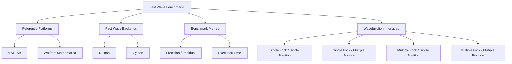

# ⚡ Fast Wave Benchmarks

<p>
  
  
  
  
  
  
</p>

A compact benchmark repository for **[Fast Wave](https://github.com/fobos123deimos/fast-wave)**, focused on numerical **precision** and **execution-time** comparisons against **MATLAB** and **Wolfram Mathematica**.

The supplied benchmarks evaluate the fixed-precision **Numba** and **Cython** implementations of Fast Wave for the position-space wavefunctions of Fock states of the quantum harmonic oscillator. The comparisons cover single and multiple Fock states, single and multiple positions, numerical residuals, and runtime measurements.

The repository intentionally contains only the original benchmark notebooks/scripts, their exported PDF reports, this documentation, and the MIT license.

---

## 🧭 Table of Contents

- [⚡ Fast Wave Benchmarks](#-fast-wave-benchmarks)
  - [🧭 Table of Contents](#-table-of-contents)
  - [🧭 Conceptual Map](#-conceptual-map)
  - [🎯 Benchmark Scope](#-benchmark-scope)
  - [📂 Repository Structure](#-repository-structure)
  - [✅ Main Usage per File](#-main-usage-per-file)
    - [MATLAB](#matlab)
    - [Wolfram Mathematica](#wolfram-mathematica)
  - [🌊 Mathematical Background](#-mathematical-background)
- [\\psi\_n(x)](#psi_nx)
  - [🧩 Benchmark Interfaces](#-benchmark-interfaces)
    - [1. Single Fock / Single Position — `sfsp`](#1-single-fock--single-position--sfsp)
    - [2. Single Fock / Multiple Positions — `sfmp`](#2-single-fock--multiple-positions--sfmp)
    - [3. Multiple Fock / Single Position — `mfsp`](#3-multiple-fock--single-position--mfsp)
    - [4. Multiple Fock / Multiple Positions — `mfmp`](#4-multiple-fock--multiple-positions--mfmp)
  - [🎯 Precision Benchmarks](#-precision-benchmarks)
  - [⏱️ Speed Benchmarks](#️-speed-benchmarks)
    - [MATLAB](#matlab-1)
    - [Wolfram Mathematica](#wolfram-mathematica-1)
  - [⚙️ Benchmark Parameters](#️-benchmark-parameters)
  - [🧮 MATLAB Reference Functions](#-matlab-reference-functions)
    - [`wavefunction_MATLAB_1.m`](#wavefunction_matlab_1m)
    - [`wavefunction_MATLAB_2.m`](#wavefunction_matlab_2m)
    - [`wavefunction_MATLAB_3.m`](#wavefunction_matlab_3m)
    - [`wavefunction_MATLAB_4.m`](#wavefunction_matlab_4m)
  - [🧠 Dependencies and Requirements](#-dependencies-and-requirements)
    - [Common requirement](#common-requirement)
    - [MATLAB side](#matlab-side)
    - [Wolfram Mathematica side](#wolfram-mathematica-side)
  - [▶️ How to Reproduce the MATLAB Benchmarks](#️-how-to-reproduce-the-matlab-benchmarks)
  - [▶️ How to Reproduce the Wolfram Mathematica Benchmarks](#️-how-to-reproduce-the-wolfram-mathematica-benchmarks)
  - [📄 PDF Reports](#-pdf-reports)
  - [⚠️ Reproducibility Notes](#️-reproducibility-notes)
  - [⚡ Fast Wave](#-fast-wave)
  - [📜 License](#-license)

---

## 🧭 Conceptual Map



---

## 🎯 Benchmark Scope

The repository compares Fast Wave with two independent scientific-computing environments:

| Reference environment | Fast Wave backend | Precision tests | Speed tests | Native notebook format | Exported report |
| --- | --- | :---: | :---: | --- | --- |
| MATLAB | Numba | ✅ | ✅ | `.mlx` | `.pdf` |
| MATLAB | Cython | ✅ | ✅ | `.mlx` | `.pdf` |
| Wolfram Mathematica | Numba | ✅ | ✅ | `.nb` | `.pdf` |
| Wolfram Mathematica | Cython | ✅ | ✅ | `.nb` | `.pdf` |

The tests exercise the Fast Wave APIs for:

```text
sfsp = single Fock state, single position
sfmp = single Fock state, multiple positions
mfsp = multiple Fock states, single position
mfmp = multiple Fock states, multiple positions
```

Some Numba benchmarks also explicitly evaluate the normalized Hermite-coefficient-matrix path through the `CS_matrix` option.

---

## 📂 Repository Structure

The structure is deliberately shallow so that the MATLAB helper functions remain beside the MATLAB Live Scripts and the benchmark files can be opened without additional path management.

```text
fast-wave-benchmarks/
│
├── README.md
├── LICENSE
│
├── matlab/
│   ├── wavefunction_MATLAB_1.m
│   ├── wavefunction_MATLAB_2.m
│   ├── wavefunction_MATLAB_3.m
│   ├── wavefunction_MATLAB_4.m
│   ├── MATLAB_Wavefunction_Precision_Tests_Numba.mlx
│   ├── MATLAB_Wavefunction_Precision_Tests_Numba.pdf
│   ├── MATLAB_Wavefunction_Precision_Tests_Cython.mlx
│   ├── MATLAB_Wavefunction_Precision_Tests_Cython.pdf
│   ├── MATLAB_Wavefunction_Speed_Tests_Numba.mlx
│   ├── MATLAB_Wavefunction_Speed_Tests_Numba.pdf
│   ├── MATLAB_Wavefunction_Speed_Tests_Cython.mlx
│   └── MATLAB_Wavefunction_Speed_Tests_Cython.pdf
│
└── wolfram-mathematica/
    ├── Wolfram_Mathematica_Wavefunction_Precision_Tests_Numba.nb
    ├── Wolfram_Mathematica_Wavefunction_Precision_Tests_Numba.pdf
    ├── Wolfram_Mathematica_Wavefunction_Precision_Tests_Cython.nb
    ├── Wolfram_Mathematica_Wavefunction_Precision_Tests_Cython.pdf
    ├── Wolfram_Mathematica_Wavefunction_Speed_Tests_Numba.nb
    ├── Wolfram_Mathematica_Wavefunction_Speed_Tests_Numba.pdf
    ├── Wolfram_Mathematica_Wavefunction_Speed_Tests_Cython.nb
    └── Wolfram_Mathematica_Wavefunction_Speed_Tests_Cython.pdf
```

---

## ✅ Main Usage per File

### MATLAB

| File | Purpose |
| --- | --- |
| `wavefunction_MATLAB_1.m` | Direct evaluation of a single Fock-state wavefunction using the normalized Hermite-polynomial expression. |
| `wavefunction_MATLAB_2.m` | Recurrence-based evaluation up to a requested Fock state, returning the selected final state. |
| `wavefunction_MATLAB_3.m` | Direct evaluation of multiple Fock states at a single position. |
| `wavefunction_MATLAB_4.m` | Direct evaluation of multiple Fock states over multiple positions. |
| `MATLAB_Wavefunction_Precision_Tests_Numba.mlx` | Precision/residual comparisons between MATLAB and the Fast Wave Numba backend. |
| `MATLAB_Wavefunction_Precision_Tests_Cython.mlx` | Precision/residual comparisons between MATLAB and the Fast Wave Cython backend. |
| `MATLAB_Wavefunction_Speed_Tests_Numba.mlx` | Runtime comparisons between MATLAB and the Fast Wave Numba backend. |
| `MATLAB_Wavefunction_Speed_Tests_Cython.mlx` | Runtime comparisons between MATLAB and the Fast Wave Cython backend. |
| corresponding `.pdf` files | Static exports of the Live Script benchmark results. |

### Wolfram Mathematica

| File | Purpose |
| --- | --- |
| `Wolfram_Mathematica_Wavefunction_Precision_Tests_Numba.nb` | Precision/residual comparisons between Mathematica and the Fast Wave Numba backend. |
| `Wolfram_Mathematica_Wavefunction_Precision_Tests_Cython.nb` | Precision/residual comparisons between Mathematica and the Fast Wave Cython backend. |
| `Wolfram_Mathematica_Wavefunction_Speed_Tests_Numba.nb` | Runtime comparisons between Mathematica and the Fast Wave Numba backend. |
| `Wolfram_Mathematica_Wavefunction_Speed_Tests_Cython.nb` | Runtime comparisons between Mathematica and the Fast Wave Cython backend. |
| corresponding `.pdf` files | Static exports of the Mathematica notebook benchmark results. |

---

## 🌊 Mathematical Background

Fast Wave evaluates the normalized position-space eigenfunctions of a quantum harmonic oscillator in the dimensionless coordinate $x$.

For a Fock state $n$,

$$
\psi_n(x)
=
\frac{1}{\pi^{1/4}\sqrt{2^n n!}}
H_n(x)e^{-x^2/2},
\qquad n\in\mathbb{N}_0,
$$

where $H_n(x)$ is the Hermite polynomial of degree $n$.

The MATLAB reference function `wavefunction_MATLAB_1.m` evaluates this expression directly using variable-precision arithmetic and `hermiteH`.

The recurrence-oriented MATLAB implementation follows the normalized Hermite-function recurrence used to obtain successive Fock-state wavefunctions without directly rebuilding every Hermite polynomial.

---

## 🧩 Benchmark Interfaces

The benchmark notebooks are organized around four computational shapes.

### 1. Single Fock / Single Position — `sfsp`

```text
input:  n, x
output: ψ_n(x)
```

### 2. Single Fock / Multiple Positions — `sfmp`

```text
input:  n, X = [x₁, x₂, ..., xₘ]
output: [ψ_n(x₁), ψ_n(x₂), ..., ψ_n(xₘ)]
```

### 3. Multiple Fock / Single Position — `mfsp`

```text
input:  n_max, x
output: [ψ_0(x), ψ_1(x), ..., ψ_nmax(x)]
```

### 4. Multiple Fock / Multiple Positions — `mfmp`

```text
input:  n_max, X
output: matrix of ψ_n(x_m)
```

These correspond to the Fast Wave functions used by the notebooks:

```python
psi_n_single_fock_single_position
psi_n_single_fock_multiple_position
psi_n_multiple_fock_single_position
psi_n_multiple_fock_multiple_position
```

---

## 🎯 Precision Benchmarks

The precision notebooks compare the reference implementation and Fast Wave using squared residuals.

For a scalar comparison,

$$
RS = \left(\psi_{\mathrm{reference}}-\psi_{\mathrm{Fast\ Wave}}\right)^2.
$$

For vector or matrix outputs, the notebooks aggregate the squared element-wise residuals using a mean value.

The precision suites include tests at representative positions such as:

```text
x = 1.0
x = 10.0
x = 20.0
```

and multiple-position tests over a grid spanning approximately

```text
[-20, 20] with 100 positions
```

with Fock-state sweeps up to `n = 100` in the supplied precision notebooks.

---

## ⏱️ Speed Benchmarks

The speed notebooks compare execution times in milliseconds.

### MATLAB

The MATLAB Live Scripts use `timeit` for the measured functions and plot runtime as a function of the Fock-state index.

The supplied MATLAB speed tests use:

```text
precision = 100 digits
N_max = 10
x = 20.0
multiple-position grid = 100 points over [-20, 20]
```

### Wolfram Mathematica

The Mathematica notebooks use `RepeatedTiming` for Mathematica reference evaluations and Python `timeit` inside `ExternalEvaluate` for Fast Wave calls.

The supplied Mathematica speed notebooks use Fock-state sweeps up to `Nmax = 100`; Python timing sections include repeated Fast Wave calls and report runtimes in milliseconds.

> Runtime measurements are environment-dependent. CPU, operating system, Python configuration, JIT warm-up, MATLAB/Mathematica versions, and background processes can all affect the observed values.

---

## ⚙️ Benchmark Parameters

The benchmark files use the following recurring configuration values:

| Parameter | Precision notebooks | MATLAB speed notebooks | Mathematica speed notebooks |
| --- | ---: | ---: | ---: |
| Arithmetic precision for the reference calculation | 100 digits | 100 digits | 100 digits |
| Maximum Fock state | 100 | 10 | 100 |
| Single positions used | 1.0, 10.0, 20.0 | 20.0 | 20.0 in timing sections |
| Multiple-position interval | -20 to 20 | -20 to 20 | -20 to 20 |
| Number of positions | 100 | 100 | 100 |

These values describe the supplied notebooks; they are not requirements of Fast Wave itself.

---

## 🧮 MATLAB Reference Functions

### `wavefunction_MATLAB_1.m`

Direct normalized Hermite-polynomial formulation for one Fock state.

```text
(n, x, precision) -> ψ_n(x)
```

### `wavefunction_MATLAB_2.m`

Recurrence-based construction of normalized wavefunctions up to `n`, returning the final requested state.

```text
(n, X, precision) -> ψ_n(X)
```

### `wavefunction_MATLAB_3.m`

Direct Hermite-polynomial evaluation for all states from `0` through `n` at one position.

```text
(n, x, precision) -> [ψ_0(x), ..., ψ_n(x)]
```

### `wavefunction_MATLAB_4.m`

Direct Hermite-polynomial evaluation for states `0` through `n` over an array of positions.

```text
(n, X, precision) -> matrix ψ_n(X)
```

---

## 🧠 Dependencies and Requirements

### Common requirement

Fast Wave must be installed in the Python environment used by the host application:

```bash
pip install fast-wave
```

The benchmark notebooks import the two fixed-precision backends directly:

```python
import fast_wave.wavefunction_numba
import fast_wave.wavefunction_cython
```

### MATLAB side

The supplied files rely on MATLAB functionality including:

```text
Live Scripts (.mlx)
Python interoperability (`py.*`)
timeit
Symbolic Math Toolbox functionality such as digits, vpa, gamma, and hermiteH
```

### Wolfram Mathematica side

The supplied notebooks rely on:

```text
Wolfram Mathematica notebooks (.nb)
ExternalEvaluate with a configured Python environment
RepeatedTiming
SetPrecision
HermiteH
plotting and numerical list operations
```

---

## ▶️ How to Reproduce the MATLAB Benchmarks

1. Configure MATLAB to use a Python environment compatible with Fast Wave.
2. Install Fast Wave in that Python environment:

```bash
pip install fast-wave
```

3. Open the repository's `matlab/` directory as the MATLAB working folder.
4. Keep the four `wavefunction_MATLAB_*.m` reference functions in that directory.
5. Open one of the `.mlx` benchmark files.
6. Run the Live Script from top to bottom.

For example:

```text
matlab/MATLAB_Wavefunction_Precision_Tests_Numba.mlx
```

or:

```text
matlab/MATLAB_Wavefunction_Speed_Tests_Cython.mlx
```

---

## ▶️ How to Reproduce the Wolfram Mathematica Benchmarks

1. Ensure Wolfram Mathematica can access a Python environment through `ExternalEvaluate`.
2. Install Fast Wave in that Python environment:

```bash
pip install fast-wave
```

3. Open one of the notebooks from `wolfram-mathematica/`.
4. Evaluate the notebook from the global-variable section through the benchmark cells.

For example:

```text
wolfram-mathematica/Wolfram_Mathematica_Wavefunction_Precision_Tests_Numba.nb
```

or:

```text
wolfram-mathematica/Wolfram_Mathematica_Wavefunction_Speed_Tests_Cython.nb
```

The notebooks call Fast Wave through Mathematica's Python external-evaluation interface.

---

## 📄 PDF Reports

Every supplied benchmark notebook has a corresponding PDF export.

This makes it possible to inspect the recorded benchmark plots and results without opening MATLAB or Wolfram Mathematica.

```text
*.mlx / *.nb   -> executable benchmark notebook
*.pdf          -> exported static benchmark report
```

The PDF files should be treated as snapshots of the environment and library state used when they were generated. Re-running the notebooks on another machine may produce different runtime values.

---

## ⚠️ Reproducibility Notes

- Fast Wave must be installed in the **same Python environment** exposed to MATLAB or Mathematica.
- Precision and runtime are different benchmark goals; a faster execution time does not by itself imply greater numerical accuracy.
- JIT compilation can influence the first calls to Numba functions.
- Cython performance depends on the compiled Fast Wave extension available in the installed package.
- MATLAB and Mathematica reference calculations use high-precision arithmetic in the supplied notebooks, while the Fast Wave Numba/Cython modules are fixed-precision implementations.
- The PDFs are included as benchmark records, not as executable sources.
- No benchmark values are hard-coded into this README because the executable notebooks and their PDF exports are the canonical records of the supplied experiments.

---

## ⚡ Fast Wave

Fast Wave is a Python package for efficient evaluation of Fock-state wavefunctions of the quantum harmonic oscillator, including optimized **Numba** and **Cython** implementations.

Repository:

```text
https://github.com/fobos123deimos/fast-wave
```

Installation:

```bash
pip install fast-wave
```

This benchmark repository is complementary to Fast Wave and is intended to keep the MATLAB and Wolfram Mathematica comparison material separate from the package source code.

---

## 📜 License

The contents of this benchmark repository are distributed under the **MIT License**. See [`LICENSE`](LICENSE).

Fast Wave itself is a separate project and is distributed under its own license.
